# Project Data Analyst 1

original order: 

Budget Analyst Needed for Local Government Projects

Worldwide We're seeking a skilled budget analyst to assist in researching and compiling budget information for local governments across the United States. The ideal candidate should have experience in data gathering, and an understanding of government budgets. Detailed instructions will be provided upon selection. The ideal deadline of this project is Friday, December 13. If you have a keen eye for detail and a passion for public finance, we would love to hear from you!

$175.00

Fixed-price
Intermediate
I am looking for a mix of experience and value
Project Type: Ongoing project
Skills and Expertise
Market Research Types
Online Research
Other
Microsoft Excel


## Nama project : Analisa Anggaran untuk riset data dan kompilasi informasi.

Berikut adalah langkah untuk melatih kemampuan sebagai Budget Analyst dengan dataset:

### 1. Pemahaman Proyek
- Tugas utama: Mengumpulkan dan menyusun informasi anggaran.
- Keterampilan yang dibutuhkan:
    - Riset daring (online research).
    - Microsoft Excel untuk menyusun data.
    - Pemahaman dasar tentang anggaran pemerintah.
- Batas waktu pengerjaan: 4 hari.

### 2. Dataset
Gunakan data simulasi seperti laporan anggaran pemerintah lokal dari beberapa kota di AS. Contoh data dapat mencakup:

- Total pendapatan dan pengeluaran per tahun.
- Sumber pendapatan (pajak, hibah, dll.).
- Kategori pengeluaran (pendidikan, transportasi, dll.).

### 3. Proses Pengerjaan
#### A. Riset Awal
- Pahami struktur anggaran pemerintah dengan mencari laporan anggaran kota atau negara bagian di AS secara daring.
- Identifikasi pola umum, seperti kategori pengeluaran dan sumber pendapatan.

#### B. Pembuatan Dataset
- Gunakan Excel untuk membuat tabel berisi:
    - Kota/Negara bagian.
    - Pendapatan (dari berbagai sumber).
    - Pengeluaran (dibagi dalam kategori utama).
    - Surplus atau defisit anggaran.

- Tambahkan kolom untuk analisis, seperti persentase alokasi untuk pendidikan.

#### C. Analisis Data
- Gunakan Excel untuk membuat grafik dan pivot table.
- Analisis tren seperti kota dengan surplus/defisit terbesar atau alokasi pengeluaran terbesar.

#### 4. Dokumentasi
- Simpan semua data dan grafik di Excel.
- Dokumentasikan proses riset dan analisis di dokumen Markdown dan push ke GitHub.

#### 5. Langkah Selanjutnya
- Buat laporan singkat dalam format profesional untuk menyerupai hasil proyek asli.
- Jika diperlukan, saya bisa memandu pembuatan laporan ini.

### Struktur Dataset
1. Kolom Pendapatan dan Pengeluaran:
    - City/State: Nama kota atau negara bagian.
    - Year: Tahun anggaran.
    - Total Revenue: Total pendapatan kota (USD).
    - Total Expenditure: Total pengeluaran kota (USD).
    - Revenue Sources:
        - Taxes: Pendapatan dari pajak.
        - Grants: Pendapatan dari hibah.
        - Fees: Pendapatan dari biaya layanan.
    - Expenditure Categories:
        - Education: Anggaran pendidikan.
        - Healthcare: Anggaran kesehatan.
        - Infrastructure: Anggaran infrastruktur.
        - Public Safety: Anggaran keamanan publik.
        - Others: Pengeluaran lainnya.
    - Surplus/Deficit: Total Revenue - Total Expenditure.
    - Dataset tersedia di folder data/raw

### Langkah Pengerjaan Budget Analyst proyek.

#### Langkah 1: Unduh dan Tinjau Dataset

- Buka file Excel dan pelajari strukturnya:
- Perhatikan kolom pendapatan, pengeluaran, dan kategori lainnya.
- Perhatikan bagaimana "Surplus/Deficit" dihitung.

Output: Anda memahami isi dan struktur dataset.

#### Langkah 2: Analisis Data Awal

- Bersihkan Data (Data Cleaning)
- Cek konsistensi data di setiap kolom.
- Pastikan tidak ada nilai kosong (missing value).
- Validasi apakah "Surplus/Deficit" sesuai dengan rumusnya.
- Buat Visualisasi Sederhana

- Gunakan Excel untuk membuat diagram batang:
- Pendapatan vs. Pengeluaran untuk setiap kota.
- Alokasi anggaran per kategori (Education, Healthcare, dll.).

Output: Dataset bersih dan terdapat grafik dasar.

#### Langkah 3: Analisis Lanjutan

Tentukan Tren

- Kota dengan Surplus tertinggi dan terendah.
- Alokasi anggaran terbesar di kategori mana?
- Kota dengan pengeluaran paling efisien (persentase pengeluaran terhadap pendapatan rendah).
- Gunakan Pivot Table

Buat pivot table untuk menghitung rata-rata:

- Pendapatan dan pengeluaran per kategori.
- Perbandingan antar kota.

Output: Insight mendalam tentang efisiensi anggaran dan tren pengeluaran.

#### Langkah 4: Laporan Anggaran

Tulis Laporan Sederhana

- Gunakan format profesional:
- Pendahuluan: Deskripsi dataset dan tujuan analisis.
- Analisis: Temuan utama dari data.
- Kesimpulan: Rekomendasi berdasarkan temuan.
- Gunakan template laporan untuk latihan.
- Sisipkan Grafik
- Masukkan grafik dari Excel ke laporan.

Output: Laporan dalam format Word atau PDF.

#### Langkah 5: Dokumentasi untuk Portofolio

- Unggah ke GitHub
- Buat repository baru.
- Upload file dataset, laporan, dan dokumentasi analisis.
- Tambahkan README

- Jelaskan tujuan proyek.
- Sertakan insight utama dan grafik dalam README.

Output: Portofolio siap dipamerkan di LinkedIn atau platform lainnya.

#### Langkah 6: Simulasi Wawancara

Tinjau kembali pekerjaan Anda dan pahami semua langkah analisis.
Jawab pertanyaan simulasi, seperti:
- Bagaimana Anda menganalisis efisiensi anggaran?
- Apa insight utama yang Anda temukan?

Output: Anda siap menjelaskan proyek ini sebagai bagian dari pengalaman Anda.

#### Langkah 2: Analisis Data Awal

2.1. Membersihkan Data (Data Cleaning)

Buka file Excel:

- Gunakan Excel atau perangkat lunak pengolah spreadsheet lainnya.
- Periksa apakah ada data kosong (missing values) dalam dataset. Anda bisa memeriksa ini di Excel dengan cara mencari sel kosong atau menggunakan fitur **Find & Select** > Go To Special > Blanks. 
(Cek -> Klik menu home -> Lihat paling kiri atas Find & Select)

Mengisi cell yang kosong 

Gunakan Find & Replace

Pergi ke tab Home > Find & Select > Replace.
Di kotak dialog Find and Replace, lakukan:
Find what: Biarkan kosong.
Replace with: Masukkan nilai yang ingin Anda gunakan (misalnya, 0, N/A, atau nilai lain).
Klik Replace All.
Semua sel kosong dalam area yang dipilih akan diisi dengan nilai tersebut.

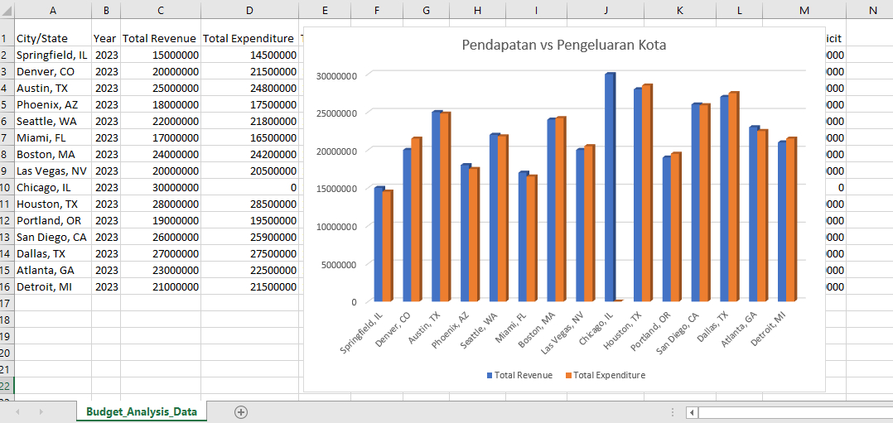

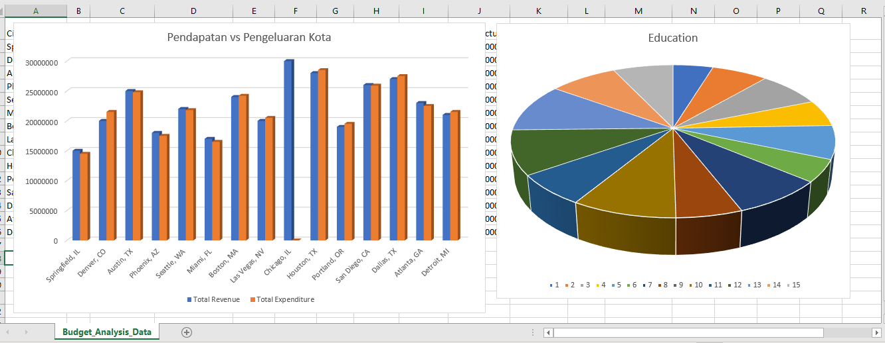

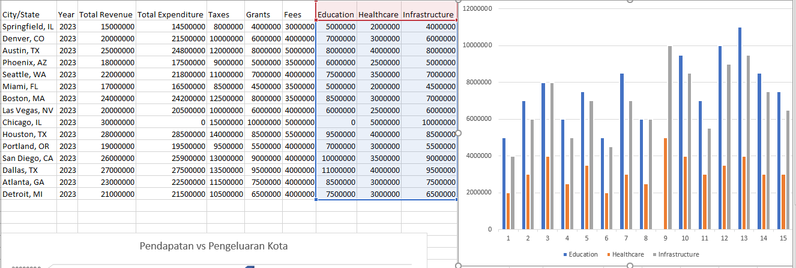

Grafik perbandingan antara besaran Edu, Health & Infra pada setiap kota.

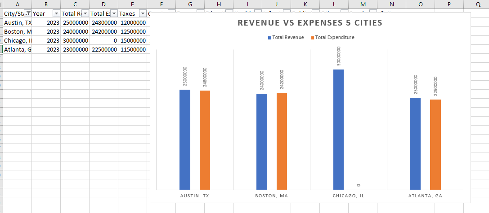

Grafik menampilkan 5 kota perbandingan antara Revenue vs Expenses.

### Langkah 3: Analisis Lanjutan

3.1. Identifikasi Tren Utama

1. Cari Kota dengan Surplus dan Defisit Tertinggi:

- Urutkan dataset berdasarkan kolom "Surplus/Deficit" secara descending untuk menemukan kota dengan surplus terbesar.

Output:

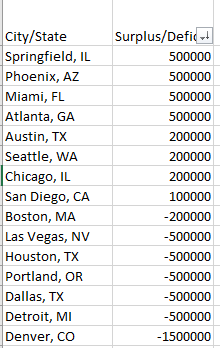

Grafik urutan kota berdasarkan surplus tertinggi.

- Urutkan kembali secara ascending untuk menemukan kota dengan defisit terbesar.

Output:

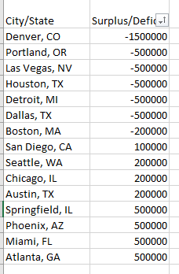

Grafik urutan kota berdasarkan defisit tertinggi.

2. Tentukan Alokasi Anggaran Terbesar:

- Hitung total untuk setiap kolom kategori (Education, Healthcare, Infrastructure, dll.).
- Catat kategori dengan anggaran tertinggi dan terendah.
- Daftar kota dengan surplus dan defisit tertinggi.
- Kategori dengan alokasi anggaran terbesar dan terkecil.

### Langkah 3: Format dan Sorot

Sorot Anggaran Tertinggi dan Terendah

Gunakan fitur Conditional Formatting untuk menyorot nilai tertinggi dan terendah:
Pilih total semua kategori.
Pergi ke tab Home > Conditional Formatting > Top/Bottom Rules:
Pilih Top 1 untuk menyorot anggaran tertinggi.
Pilih Bottom 1 untuk menyorot anggaran terendah.
Tambahkan Visualisasi (Opsional)

Anda dapat membuat grafik, seperti Pie Chart atau Bar Chart, untuk menampilkan distribusi anggaran antar kategori.

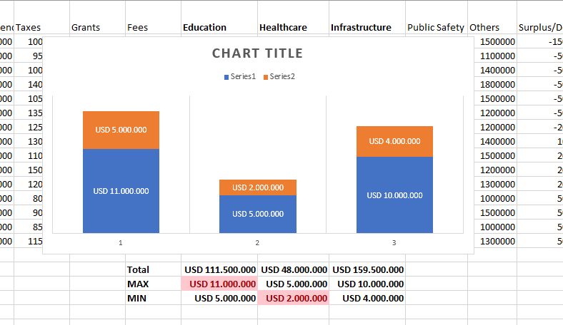

### 3.2. Gunakan Pivot Table untuk Insight Mendalam

1. Buat Pivot Table (di Excel):

- Pilih seluruh dataset, lalu klik Insert > PivotTable.
- Pilih lokasi Pivot Table (di worksheet baru atau yang sama).

2. Analisis dengan Pivot Table:

- Rata-rata Pendapatan dan Pengeluaran:
    - Seret "City/State" ke baris (Rows).
    - Seret "Total Revenue" dan "Total Expenditure" ke nilai (Values), lalu pilih fungsi rata-rata (Average).

- Persentase Alokasi Anggaran:
    - Seret "City/State" ke baris (Rows).
    - Seret kategori anggaran (Education, Healthcare, dll.) ke nilai (Values), dan pilih fungsi Sum. Tambahkan total pendapatan untuk menghitung persentase:

```
Persentase = (Anggaran Kategori / Total Revenue) * 100
```

### 3. Visualisasikan Pivot Table:

- Gunakan fitur bawaan Pivot Table untuk membuat grafik, seperti Bar Chart atau Pie Chart, untuk memperjelas hasil analisis.

Output:

Rata-rata pendapatan dan pengeluaran setiap kota.

Persentase anggaran per kategori.

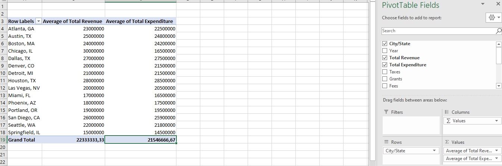

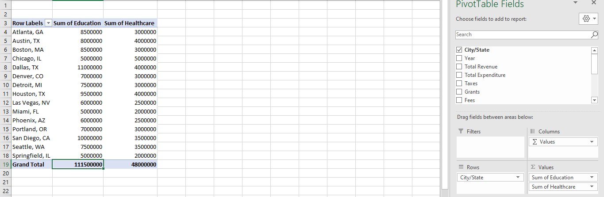

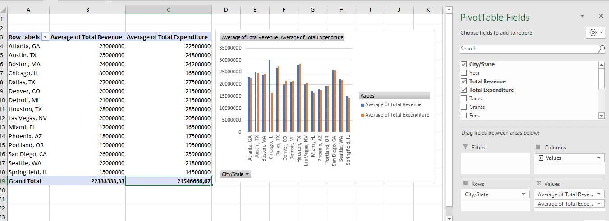

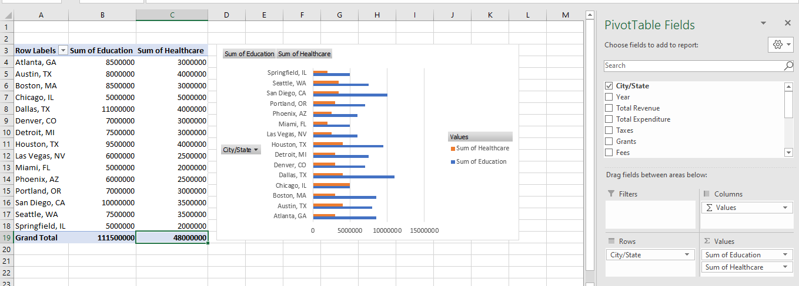

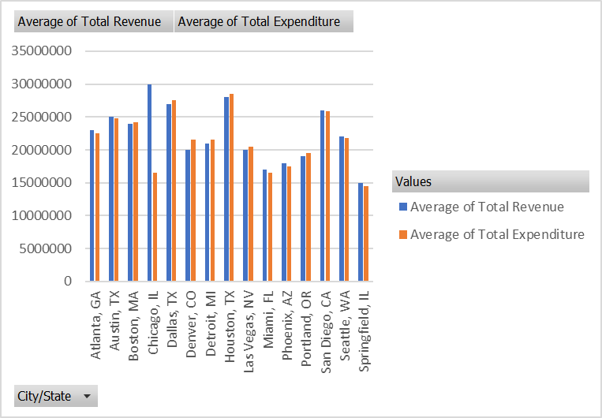

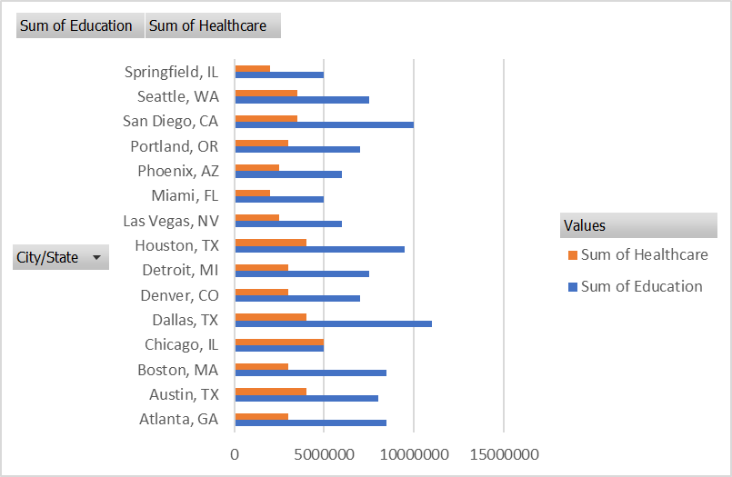

3.3. Insight Khusus
Kota dengan Pengeluaran Paling Efisien:

Tambahkan kolom baru untuk menghitung efisiensi:
mathematica
Copy code
Efisiensi = (Total Expenditure / Total Revenue) * 100
Urutkan dataset berdasarkan efisiensi dari rendah ke tinggi.
Hubungan Antara Pendapatan dan Surplus:

Buat scatter plot:
Sumbu X: "Total Revenue"
Sumbu Y: "Surplus/Deficit"
Analisis apakah ada hubungan langsung antara pendapatan tinggi dan surplus besar.
Output:

Kota dengan pengeluaran paling efisien.
Wawasan tentang hubungan antara pendapatan dan surplus.

3.4. Simpan Hasil
Simpan Pivot Table:

Pastikan Anda menyimpan Pivot Table dalam file Excel Anda.
Simpan dengan nama seperti "Budget_Analysis_Advanced.xlsx".
Dokumentasikan Insight:

Catat hasil analisis Anda, seperti:
Kota mana yang paling efisien?
Kategori apa yang paling banyak menyedot anggaran?
Apakah ada pola khusus antara pendapatan dan surplus?

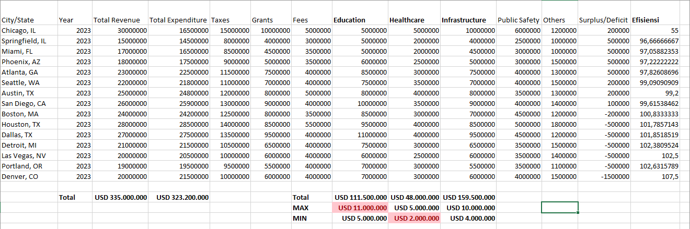

Grafik Urutan dataset berdasarkan efisiensi dari rendah ke tinggi.

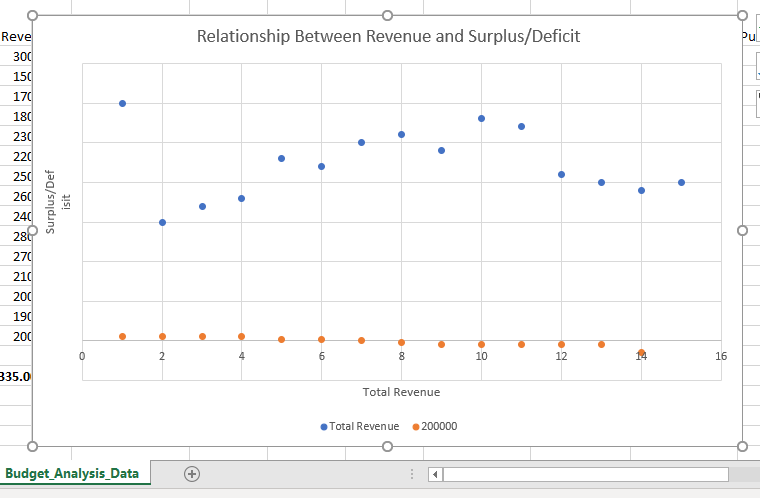

Grafik Scatter Plot Relationship Between Revenue and Surplus/Deficit

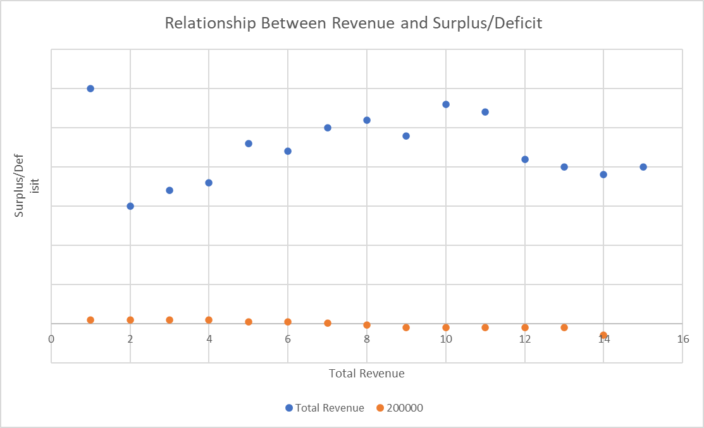


---

## Langkah 4: Laporan Anggaran

1. Tulis Laporan Sederhana

- Gunakan format profesional:
    - Pendahuluan Deskripsi dataset dan tujuan analisis.
    - Analisis: Temuan utama dari data.
    - Kesimpulan: Rekomendasi berdasarkan temuan.
- Gunakan template laporan untuk latihan.

2. Sisipkan Grafik

- Masukkan grafik dari Excel ke laporan.

Output: Laporan dalam format Word atau PDF.

### 4.1. Format Laporan

Gunakan format laporan yang umum, seperti berikut:

Judul Laporan:
"Budget Analysis for Local Government Projects – [Tanggal]"

Pendahuluan:
Jelaskan tujuan analisis, metode yang digunakan, dan ruang lingkup data.
Contoh:

This report provides an analysis of budget data from various cities and states in the U.S. The objective is to identify trends, assess financial performance, and highlight key insights. Data was analyzed using Excel with techniques like pivot tables, visualization, and efficiency calculations.

Isi Utama: a. Ikhtisar Data:

Jumlah kota yang dianalisis.
Rata-rata total pendapatan dan pengeluaran.
b. Hasil Analisis:

Kota dengan surplus terbesar dan defisit terbesar.
Kategori anggaran terbesar (Education, Healthcare, dll.).
Persentase rata-rata alokasi anggaran per kategori.
Kota dengan pengeluaran paling efisien.
c. Tren dan Hubungan:

Temuan penting dari scatter plot (pendapatan vs surplus).
Wawasan lain yang didapat.
Kesimpulan dan Rekomendasi:

Tiga hingga lima poin utama, seperti:
Kota mana yang perlu fokus pada pengelolaan pengeluaran.
Rekomendasi pengalokasian anggaran untuk kategori tertentu.
Jika ada data yang kurang atau butuh analisis lebih lanjut, tambahkan catatan di sini.
4.2. Menyusun Laporan di Word/Google Docs
Gunakan Template Profesional:

Header: "Budget Analysis Report".
Sub-header: Tanggal dan nama proyek.
Bullet points untuk memudahkan pembacaan.
Tambahkan Grafik:

Masukkan grafik pendapatan vs pengeluaran dan alokasi anggaran dari Excel.
Gunakan judul yang jelas seperti "Comparison of Revenue and Expenditure Across Cities".
Format dengan Rapi:

Gunakan font profesional seperti Arial atau Times New Roman.
Judul dan subjudul dengan ukuran lebih besar dan tebal.
Pastikan tabel atau grafik tidak terlalu padat agar mudah dibaca.
4.3. Opsi Lain: Presentasi Singkat (Jika Diminta Klien)
Gunakan PowerPoint atau Google Slides:

Slide 1: Judul dan Pendahuluan.
Slide 2: Ikhtisar Data dan Grafik Pendapatan vs Pengeluaran.
Slide 3: Hasil Analisis Utama.
Slide 4: Kesimpulan dan Rekomendasi.
Pastikan Slide Singkat dan Visual:

Maksimal 4-5 poin per slide.
Gunakan grafik untuk menggantikan teks jika memungkinkan.
4.4. Simpan dan Kirim
Simpan dokumen dalam format PDF:

Untuk dokumen Word: "Save As > PDF".
Untuk PowerPoint: "Export > PDF".
Nama File:

Gunakan nama deskriptif, misalnya: Budget_Analysis_Report_[Nama_Project].pdf.
Kirimkan ke Klien:

Sertakan catatan singkat di email atau platform pengiriman yang Anda gunakan, seperti:
Attached is the budget analysis report for your review. Please let me know if further analysis or revisions are needed.
