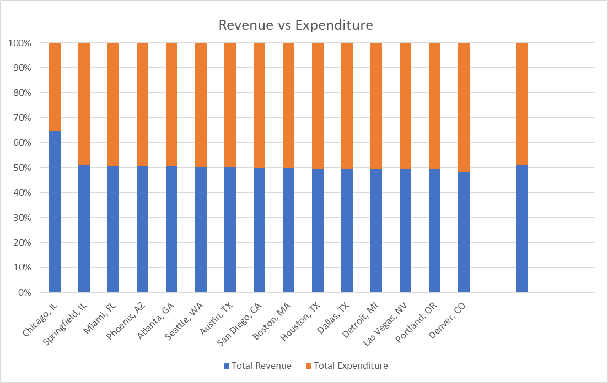
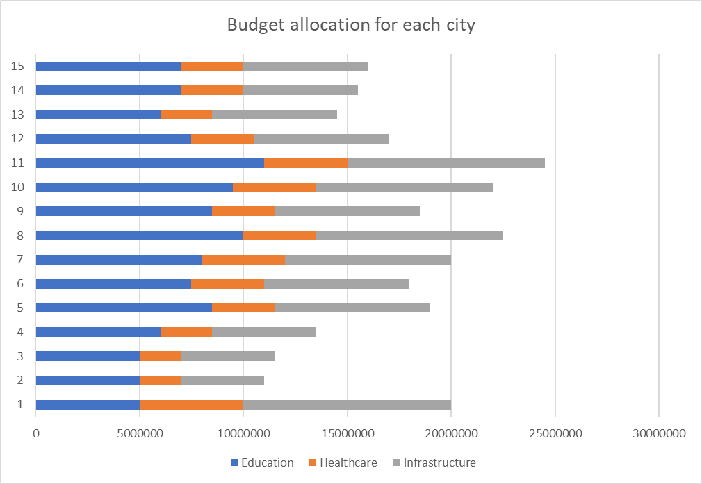
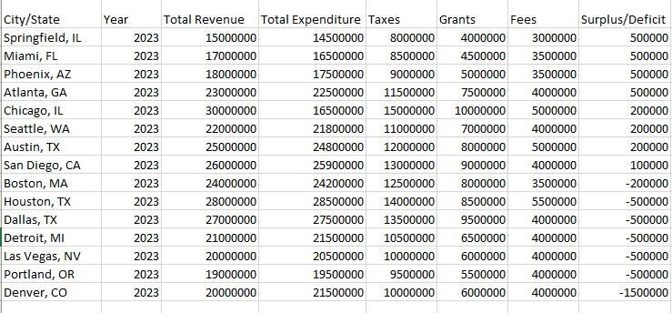
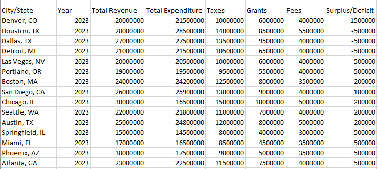
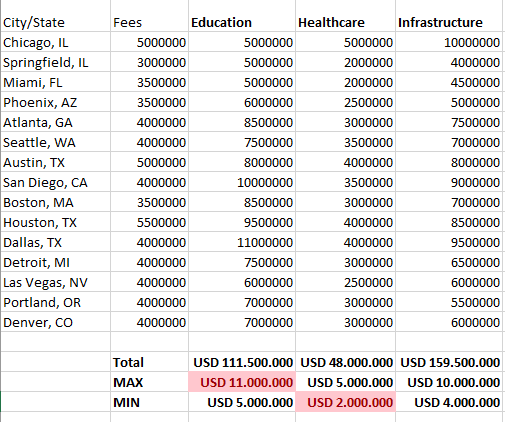
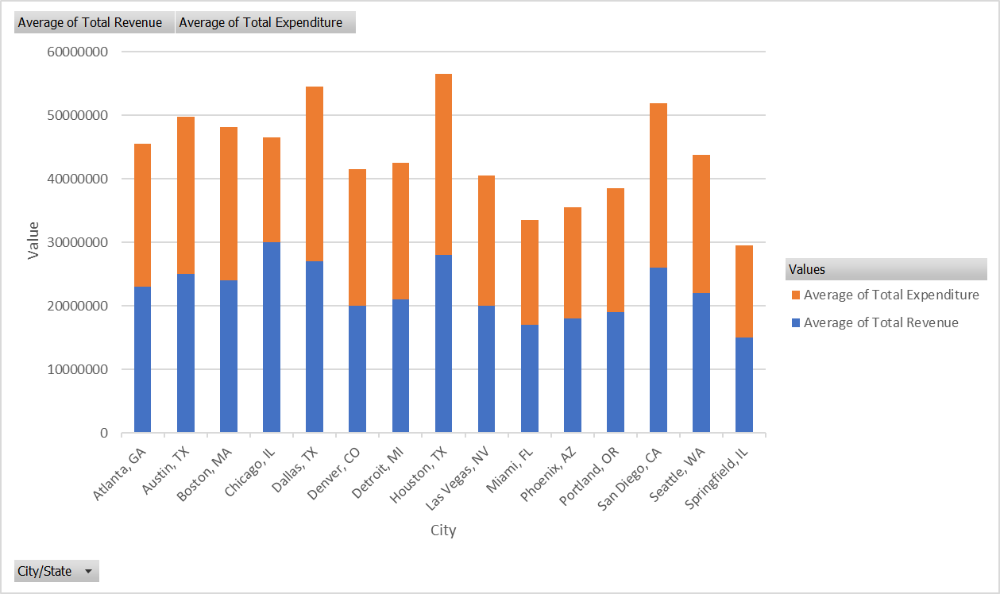
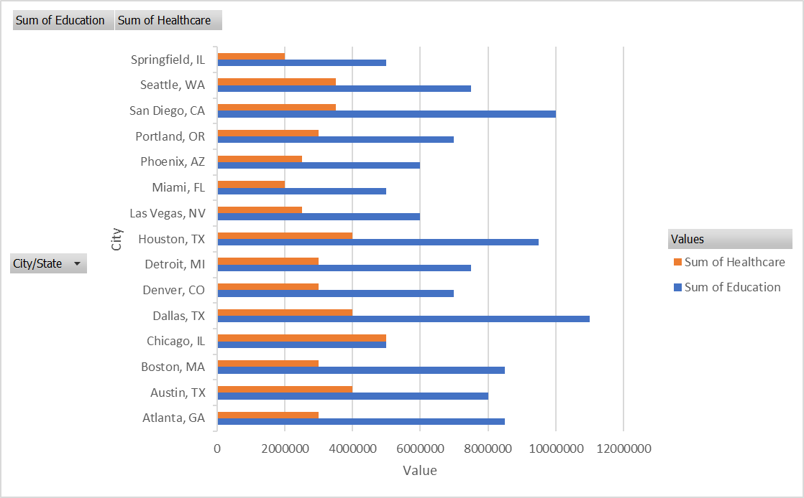
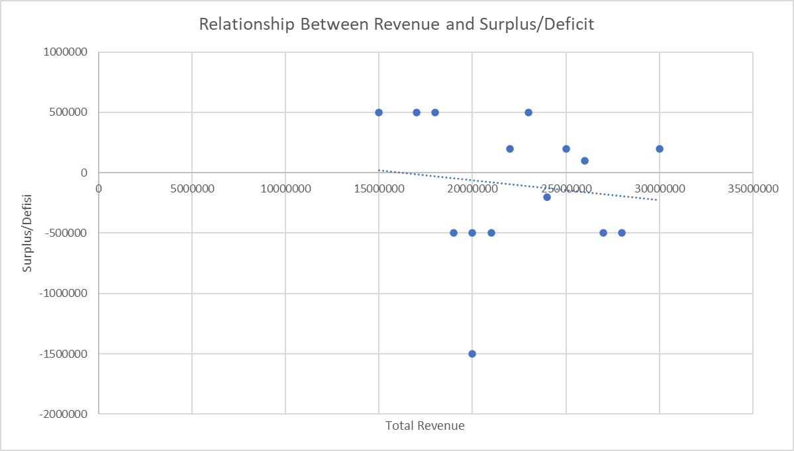

# Analysis Report 

#### 11/11/2024 - Budget Analysis for Local Government Projects

This report provides an analysis of budget data from various cities and states in the U.S. The objective is to identify trends, assess financial performance, and highlight key insights. Data was analyzed using Excel with techniques like pivot tables, visualization, and efficiency calculations.

#### Main Content: 

##### a. Data Summary
- Number of cities analyzed : 15

- Total Revenue vs Expenditure

Figure 1: Total Revenue vs Total Expenditure

- Average total Income and Expenditure.

- Budget allocation for each city

- Cities with the Highest Surplus.

- Cities with the Highest Defisit.

- Total for each column in the categories of Education, Healthcare, Infrastructure.

- Categories with the highest and lowest budgets.
    - Highest Budget: Education USD 11.000.000
    - Lowest Budget: Infrastructure USD 2.000.000
    
##### Analysis with Pivot Table 

- Average Income and Expenditure.

- Summary of Budget Allocation for each category.

##### b. Analysis Results:

- Cities with the largest surplus and the largest deficit?
- Largest budget categories (Education, Healthcare, etc.)?
- Average percentage allocation of the budget per category?
- Cities with the most efficient spending?

###### c. Trends and Relationships:

- Key findings from the scatter plot (income vs. surplus).
- Other insights gained.

->  *Membuat scatter plot di Excel untuk memvisualisasikan hubungan antara Total Revenue dan Surplus/Deficit.*

#### Conclusions and Recommendations:

- Three to five key points, such as:

    - Which cities need to focus on managing expenditures.
    - Recommendations for budget allocation to specific categories.

- Missing data or further analysis is needed ...

#### Comparison of Revenue and Expenditure Across Cities

...
Figure Income vs. Expenditure and Budget Allocation Graph

